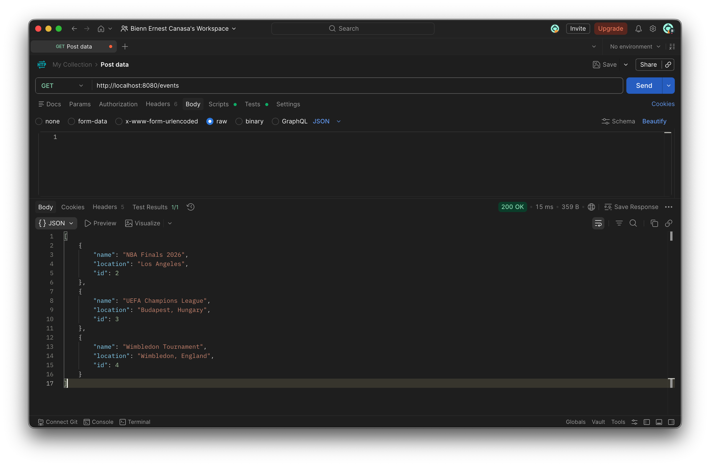
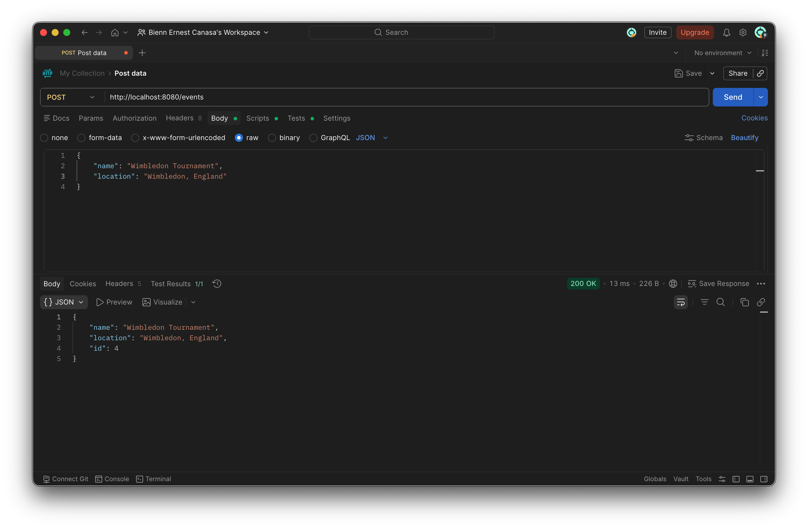

# Spring Boot Event API

REST API for managing events built with:

- Java
- Spring Boot
- PostgreSQL
- Maven
- Docker
- Postman

## Features

- Create an event
- Get all events
- Get event by ID
- Update an event
- Delete an event

## API Endpoints

### Get all events
GET /events

### Get event by id
GET /events/{id}

### Create event
POST /events

Example JSON:

{
  "name": "NBA Finals",
  "location": "Los Angeles"
}

### Update event
PUT /events/{id}

### Delete event
DELETE /events/{id}

## Technologies Used

- Spring Boot
- Spring Web
- Spring Data JPA
- PostgreSQL
- Maven
- Docker
- IntelliJ IDEA
- Postman

## API Screenshots

### GET /events

### POST /events

## Author

Bienn Ernest Canasa
